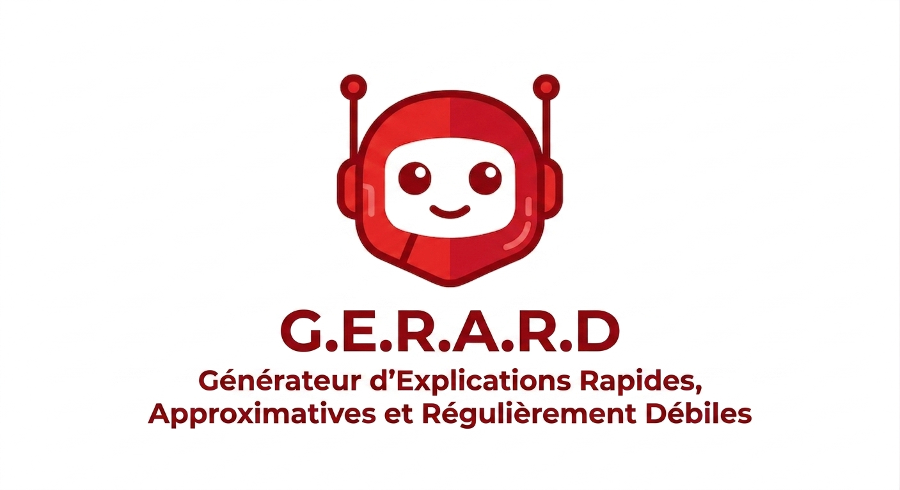

<p align="center">
    
</p>

# 🧠 G.E.R.A.R.D — Local AI Assistant

Une application innovante et ultra-rapide permettant d’interagir avec une Intelligence Artificielle locale en un seul clic. Grâce à un raccourci clavier universel, l’utilisateur peut sélectionner un texte ou poser une question pour obtenir instantanément une réponse intelligente.

Le projet combine un client léger et moderne en **.NET 10 (WPF)** et un serveur robuste en **Python (FastAPI)** orchestrant le LLM via **Ollama**. L'ensemble fonctionne à 100% en local pour garantir la confidentialité absolue de vos données.

> ⚠️ **Projet d'Innovation** : Ce dépôt est un projet de recherche, d'innovation et développement visant à explorer la réalisation professionnelle d'un projet de manière transparente dans un environnement de bureau.

---

## ✨ Features

- ⚡ **Raccourci Instantané** : Interrogez l'IA en quelques clics depuis n'importe quelle application (Ctrl + Alt + A).
- 🤖 **IA 100% Locale** : Propulsé par `qwen2.5:3b` via Ollama (aucune connexion internet requise).
- 📝 **Prompts Contextuels** : Prise en charge native de templates spécifiques (Résumé, Traduction, Réécriture, etc.).
- 📂 **Gestion de l'Historique** : Suivi complet de vos conversations passées côté client.
- ⚙️ **Architecture Propre** : Backend structuré selon les principes du DDD (Domain-Driven Design).

---

## ⌨️ Contrôles

Pour ouvrir ou fermer la fenêtre une fois le projet lancé
```text
Ctrl + Alt + A
```

---

## 🧰 Stack technique

### 🖥️ Client
- 🟣 .NET 10
- 🎨 WPF (Windows Presentation Foundation)

### ⚙️ Server & IA
- 🐍 Python 3.12+
- 🚀 FastAPI
- 🦙 Ollama (model : `qwen2.5:3b`)

---

## 🚀 Installation & Lancement

### ✅ Prérequis
- [Ollama](https://ollama.com/) installé et configuré.
- [Python 3.12+](https://www.python.org/downloads/)
- [.NET 10 SDK](https://dotnet.microsoft.com/en-us/download)

### 🧠 1. Lancer Ollama
À la racine du projet :

1. Téléchargement du modèle
```bash
ollama pull qwen2.5:3b
```

2. Lancement du serveur Ollama pour le backend
```bash
ollama serve
```

### ⚙️ 2. Lancer le Serveur (Python)
Dans le dossier `server` :

1. Installation des dépendances
```bash
pip install -r requirements.txt
```

2. Lancement de l'API
```bash
fastapi run
```

Le serveur sera accessible sur `http://localhost:8000` (Documentation Swagger disponible sur `/docs`).

### 🎨 3. Lancer le Client (.NET)
Dans le dossier `client` :

```bash
dotnet run --project client.csproj
```

---

## 🗂️ Structure du projet

```text
Innovation-Project/
│
├── 📁 client/             → Interface utilisateur (WPF / .NET 10)
│   ├── 📁 models/         → Modèles de données (Messages, Conversations)
│   ├── 📁 services/       → Logique client & Historique
│   └── 📁 views/          → Vues XAML (Home, Chat)
│
├── 📁 server/             → Serveur API & Orchestration LLM (Python)
│   ├── 📁 app/
│   │   ├── 📁 domain/     → Règles métier & Templates de Prompts (Templates, Exceptions)
│   │   ├── 📁 application/→ Services applicatifs (LLM Service, Policies)
│   │   ├── 📁 infrastructure/ → Client de communication avec Ollama
│   │   └── 📁 interfaces/ → Points d'entrée de l'API (Routes, DTOs, Schemas)
│   └── 📁 tests/          → Tests unitaires du domaine
```

---

## 📑 Structure de l'API

L'application communique via les points de terminaison principaux suivants :

| Méthode   | Endpoint        | Description                                       | Succès    | Erreur                  |
|-----------|-----------------|---------------------------------------------------|-----------|-------------------------|
| **GET**   | `/api/health`   | Vérifie l'état interne du serveur                 | `200`     | `500`                   |
| **GET**   | `/api/info`     | Renvoie les informations du serveur               | `200`     | `500`                   |
| **POST**  | `/api/generate` | Génère une réponse depuis le LLM                  | `200`     | `400`, `503`, `500`     |
| **POST**  | `/api/stream`   | Génère en streaming un réponse depuis le LLM      | `200`     | `400`, `503`, `500`     |

Voir `http://localhost:8000/docs` pour la documentation complète des body et type

---

## 📸 Screenshots

- Page d'accueil


- Génération d'une réponse


- Historique


---

## 🧑‍💻 Auteur
- **Enzo** • [enzzo95](https://github.com/enzzo95)
- **Nathan** • [nathansenglong](https://github.com/nathansenglong)
- **Eden** • [eden77-rgb](https://github.com/eden77-rgb)
